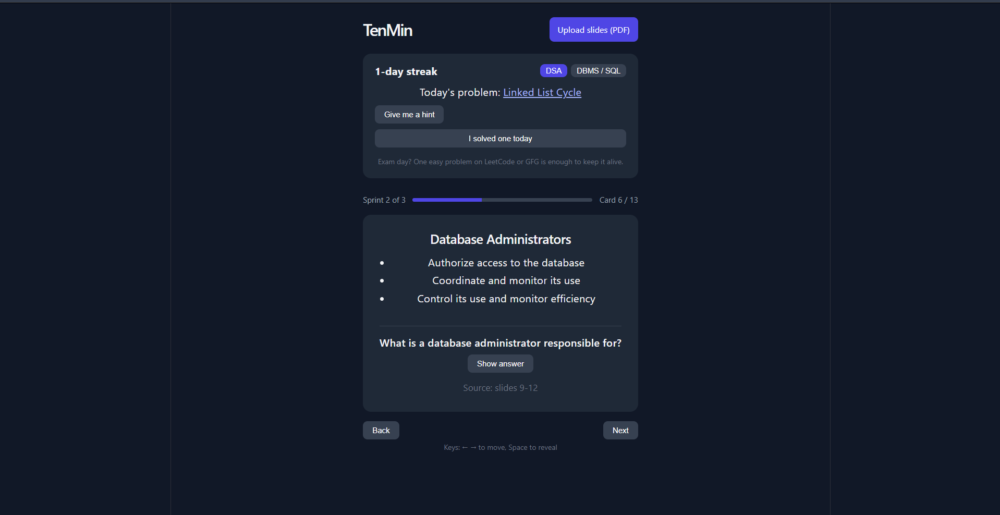

# TenMin

**Study in 10-minute sprints, with a local AI that never sends your slides anywhere.**

TenMin turns long lecture slide decks into short, scrollable study cards, and helps keep a daily coding-practice streak alive during exam season. It was built for one real person: a friend who loses focus about every 10 minutes while studying, dreads 100-slide decks, and struggles to keep up her DSA practice during exams.

Everything runs on your own laptop using an open-weight model through [Ollama](https://ollama.com). No account, no API key, no internet needed after setup.



## What it does

- **Slides to cards:** upload a PDF of your slides. A local model turns it into short cards (concept, a few bullets, one recall question).
- **Starts studying early:** cards stream in as each part of the deck is processed, so you can begin the first sprint while the rest is still being read.
- **Sprints:** cards come in a scrollable feed in groups of 5, with a break screen after each sprint. Keyboard shortcuts: left/right arrows to move, Space to reveal the answer.
- **Source pages:** every card shows which slides it came from, so you can verify it against the original.
- **Streak guard:** a daily problem (DSA or SQL) with a link to LeetCode, an "I solved one today" tick, and a streak counter. It is TenMin's own counter, stored in your browser. It cannot change your LeetCode or GFG streak.
- **AI hints:** three levels of hints for the daily problem (technique, key idea, outline). It is told never to write code.

## What my friend said

I built this for a friend and handed it over to try on her real study material. This is her feedback, in her own words:

> Honestly, I actually liked using TenMin, especially during exams when looking at a 100-slide PPT itself feels exhausting 😭. The idea of breaking everything into small cards makes studying feel a little less overwhelming, and I like that I can just go through a few cards at a time instead of forcing myself to sit and read everything at once.
>
> The recall questions are a nice touch too, because sometimes I feel like I've understood something while reading, but I can't actually remember it when I try to answer on my own. The source slide numbers are also helpful when I want to go back and check something.
>
> I also liked the daily coding streak idea because I tend to completely ignore DSA during exams and then regret it later 💀. The hints are useful when I'm stuck, especially when they give me an idea of how to approach a problem instead of just giving away the answer.
>
> But yeah, it's not perfect. Sometimes the AI-generated cards miss a few important points or don't explain things properly, so I still have to refer to the original PPT. And processing takes quite a while, especially for bigger PDFs, which can get a little annoying when I'm already short on time.
>
> Overall, I genuinely think it's a useful idea, especially for someone like me who gets overwhelmed by huge portions during exams. It's not like it magically makes studying easy, but it makes getting started a lot less stressful.

### What I took from it

- **Her biggest complaint was the wait.** After she tried it, I changed the app so cards stream in as each part of the deck is processed, instead of making her stare at a loading screen until the whole PDF is done.
- **Card quality is the harder problem.** She still has to check the original slides when cards miss points. I have not solved this. The source page on each card is there so checking is quick, but a small local model will not match a careful human summary.

## Why open-source AI

- **Your course material stays on your machine.** Slides are processed locally and never uploaded.
- **Works offline,** for example on a hostel Wi-Fi connection that keeps dropping.
- **Free to run,** with no rate limits the night before an exam.
- **Swappable.** Change one line in `server/index.js` to try a different model.

## Run it yourself

You need Node.js 18 or newer, Git, and [Ollama](https://ollama.com/download).

```bash
# 1. Get a model (about 3.3 GB)
ollama pull gemma3:4b

# 2. Clone the repo
git clone https://github.com/shreyach52/tenmin.git
cd tenmin

# 3. Start the server (terminal 1)
cd server
npm install
node index.js

# 4. Start the client (terminal 2)
cd client
npm install
npm run dev
```

Open the address Vite prints (usually http://localhost:5173), upload a PDF, and start with the first cards as soon as they appear. Long decks still take a few minutes in total on a laptop.

Tips:

- Export slides to **PDF** from PowerPoint or Google Slides first. Scanned PDFs (images only) have no text to read.
- Make sure Ollama is running (check your system tray, or run `ollama serve`).
- To use a different model, `ollama pull` it and change `MODEL` at the top of `server/index.js`.

## How it works

```
PDF  ->  Express (multer + unpdf)  ->  pages grouped in batches of 4
     ->  Ollama (gemma3:4b, JSON output)  ->  cards + page numbers
     ->  streamed to the browser batch by batch
     ->  React feed (sprints of 5 cards)
```

- Text is extracted page by page so each card can point back to its slides.
- Pages are sent to the model in small batches. Larger batches made the small model mix up topics.
- The model is asked for strict JSON, and the server cleans up and validates each card before the app shows it. A batch that comes back broken is skipped, and the rest carry on.
- The server streams results as newline-separated JSON, so the first sprint is ready long before the last batch.

## Known limitations

Being honest about these matters, because this is a small model running locally:

- **Cards can be wrong or incomplete.** In testing, a small model sometimes gave a mismatched answer or skipped parts of a section, and my friend still checked the original slides. Always verify against the source slides shown on each card. These cards are a revision aid, not a replacement for the slides.
- **Long decks are still slow in total,** even though the first cards now appear early.
- **Image-heavy slides** lose their diagrams, since only the text is read.
- **The streak is self-reported** and local to one browser.
- **AI hints can be wrong,** so check them against the problem statement.

## Tech

React (Vite), Express, Ollama with `gemma3:4b`, `unpdf` for PDF text, `multer` for uploads.

## License

MIT